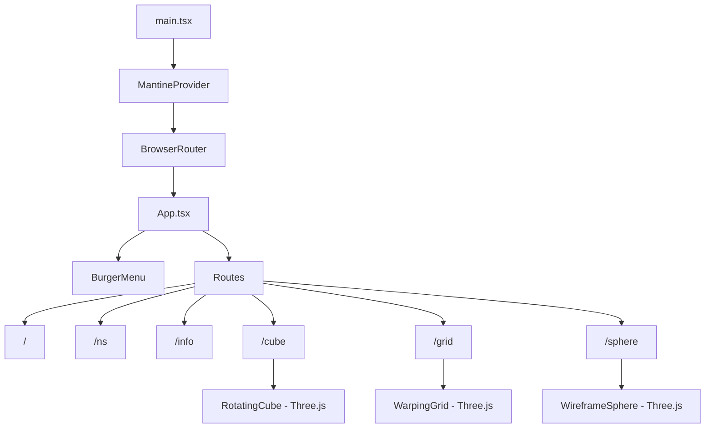
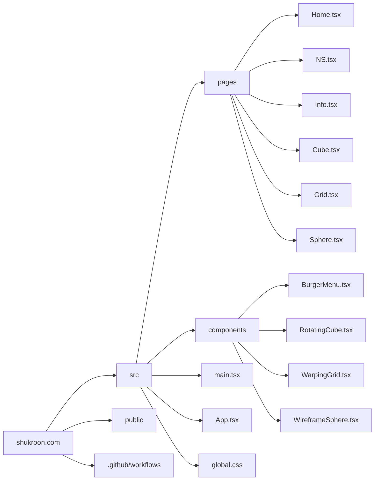

# shukroon.com

Personal website built with Vite + React 19 + TypeScript.

**Live:** [shukroon.com](https://shukroon.com)

## Tech Stack

- **Framework:** React 19 + TypeScript (strict mode)
- **Build:** Vite 7
- **UI:** Mantine v8 with custom EB Garamond theme
- **Routing:** react-router-dom v7
- **3D:** Three.js for interactive visual components
- **Styling:** CSS Modules + Mantine styles
- **Deploy:** GitHub Actions -> GitHub Pages

## Setup

```bash
npm install
npm run dev       # Start dev server
npm run build     # Type-check + production build
npm run preview   # Preview production build
```

## Architecture



## Directory Structure



## Key Design Decisions

- **Light color scheme only** — enforced via MantineProvider `defaultColorScheme="light"`
- **EB Garamond** as the sole font across headings and body text
- **Three.js canvases** are isolated in dedicated components, each rendered on its own route
- **BurgerMenu** renders globally across all pages for consistent navigation
- **CSS Modules** for component-scoped styles, supplemented by a single `global.css`

## Deployment

Push to `main` triggers the GitHub Actions workflow (`.github/workflows/deploy.yml`), which builds with Node 20 and deploys `dist/` to GitHub Pages. Custom domain configured via `CNAME` file.
